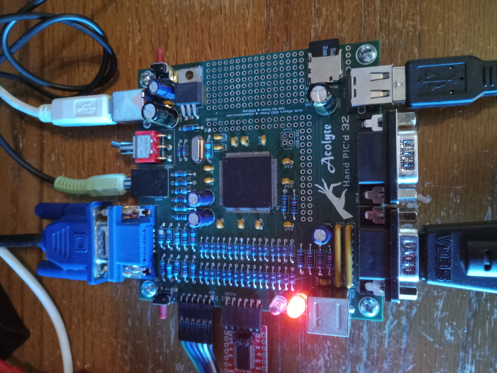
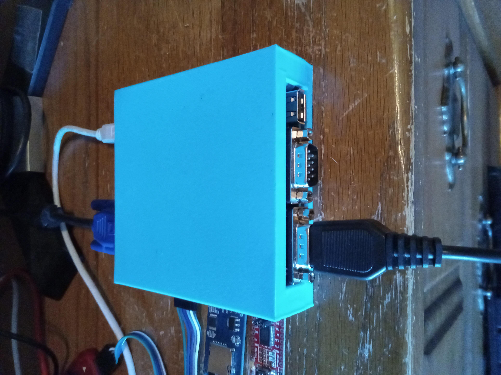
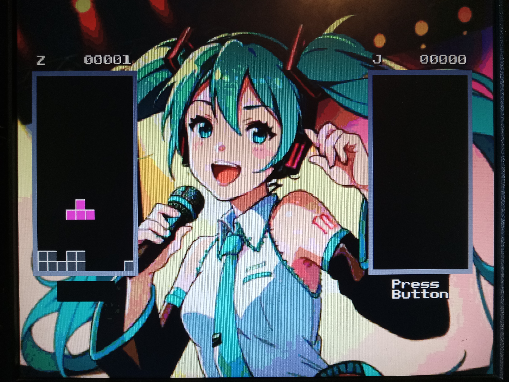
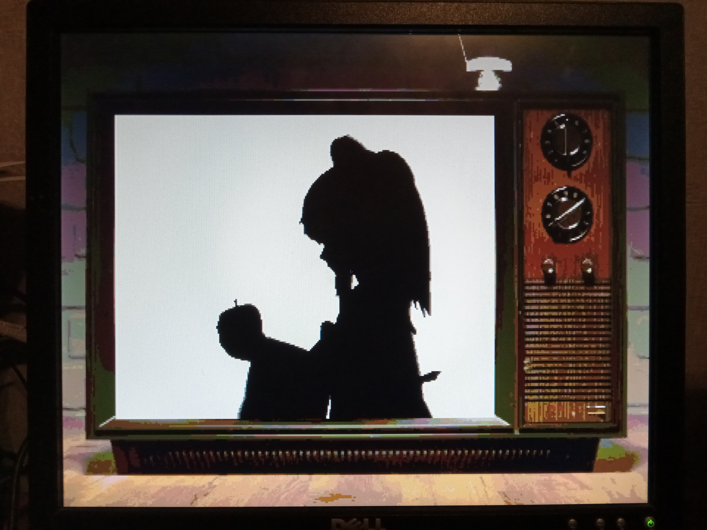
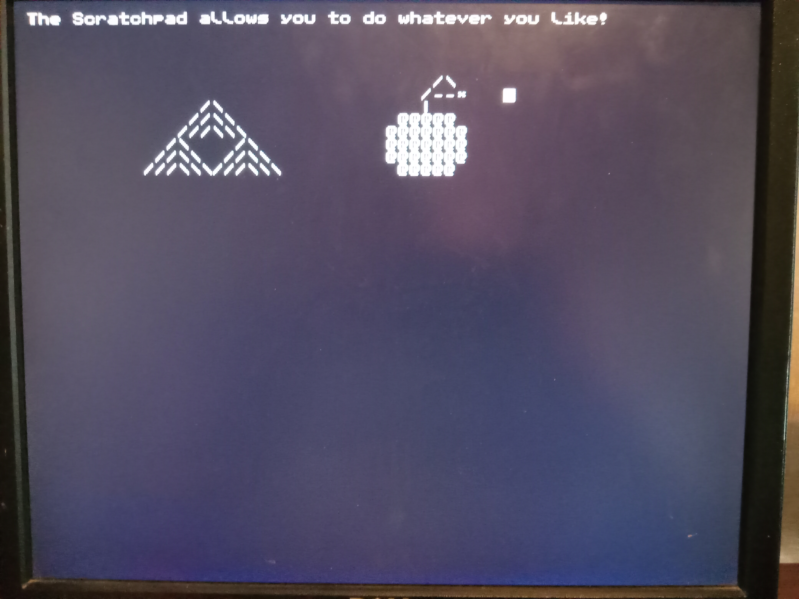
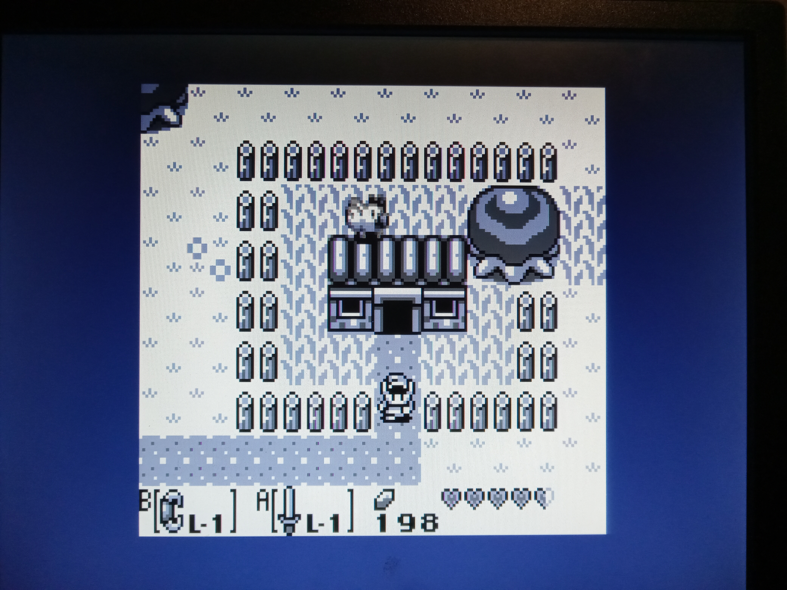
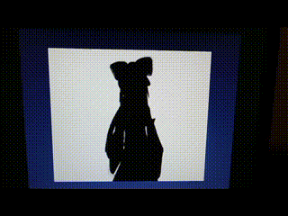

<b>Acolyte Hand PIC'd 32 Retraux Computer</b>

Using the PIC32MZ2048EFH144 microcontroller, this new now computer runs at 200 MHz, with internal memory of 512KB of RAM and 2MB of Flash ROM.  

Video output of 640x480 VGA with 256-colors.  Now supports a single 4-bit audio channel, with future possiblity of 4 total channels.  Input comes from 2x Genesis controllers, PS/2 Port with support for keyboard and mouse through splitter, and USB port with host support for keyboard, mouse, or Xbox360-type gamepad.  The USB port will eventually be used to connect to the PC as a CDC for use with /dev/ttyACM0.  The USB port could eventually support flash drives.

Comes with attachment possibilities for an SPI Micro SDcard Adapter and a FT232RL USB-to-UART Adapter.  SDcard is required for BadApple and using Elm-Chan's FatFs files (included).  If using the UART, use the command 'sudo picocom /dev/ttyUSB0'.  The PIC32 is programmed through ICSP port connecting to a PICkit3, but can also be re-programmed at general memory locations from production hex files through the SDcard.

PORTH has been bodge-wired to make an audio DAC using an R-2R Ladder.  Currently it only has 4-bits, but does the job pretty well.

The Gameboy emulator Peanut-GB (with MiniGB-APU) has been recoded for the PIC32!  Some games tested and working include: Tetris, Dr. Mario, Zelda: Link's Awakening, and Pokemon Red.  Many options have been added, such as Save/Load, GBC palettes, screen size, frame rate, and sound on/off.

Instead of playing just Bad Apple, it is now capable of running any type of video that has been modified.  The output is 240x192 in 256 colors, with support for up to 32-bit audio at a 11520 Hz sample rate.  As of now only the 4-bit audio DAC is used though.

Only PORTD, PORTE, PORTH, and PORTJ are used for all existing peripherals.  That leaves PORTA, PORTB, PORTC, PORTF, and PORTG all for user functionality.

Links:

<a href="https://www.aidanmocke.com/">https://www.aidanmocke.com/</a> for a bunch of PIC32MZ projects (without Harmony), including USB. 
<a href="http://elm-chan.org/">http://elm-chan.org/</a> for a bunch of other projects, including MMC (aka SDcard) and FatFs. 
<a href="https://github.com/deltabeard/">https://github.com/deltabeard/</a> for the Peanut-GB and MiniGB-APU projects. 

*** Board Edits: Removed the 74HC273 entirely and directly connected latch inputs to outputs.  Also added 4-bit audio DAC to PORTH pins. ***

&nbsp;&nbsp;&nbsp;&nbsp;

