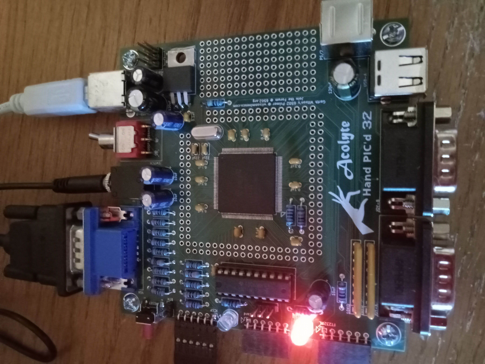

<b>Acolyte Hand PIC'd 32 Computer</b>

Using the PIC32MZ2048EFH144 microcontroller, this new computer will be running at 200 MHz, with internal memory of 512KB of RAM and 2MB of Flash ROM.  

Video output of 400x300 VGA with 256-colors.  Supports 2 independent audio square-wave signals.  Input comes from 2x Genesis controllers, PS/2 Port with support for keyboard and mouse through splitter, and potential for USB HIDs such as keyboards, mice, and hopefully joysticks.  The USB port will also support flash drives, and can also be used to talk directly to a PC in device-mode.

Comes with attachment possibilities for an SPI Micro SDcard Adapter and a FT232RL USB-to-UART Adapter.  The PIC32 is programmed through ICSP port connecting to a PICkit3.

