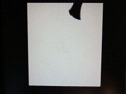

<b>Acolyte Hand PIC'd 32 Retraux Computer</b>

PIC32MZ2048EFH144 microcontroller running at 200 MHz
 
Internal memory of 512KB of RAM and 2MB of Flash ROM

<b>Video</b>

VGA 640x480 resolution at 72 Hz with 256 colors

<b>Audio</b>

Single 4-bit audio channel, adding more bits and channels in the future

<b>HID</b>

2x Sega Genesis controller ports
 
Dual PS/2 port for keyboard and mouse through splitter
 
USB port for keyboard, mouse, or Xbox-360 controller

<b>File System</b>

Elm-Chan's FatFS files using SPI Micro SD Card adapter

<b>UART</b>

FT232RL USB-to-UART adapter (use command 'sudo picocom /dev/ttyUSB0')

<b>Gameboy Emulator</b>

Peanut-GB (with MiniGB-APU) Gameboy Emulator with GBC default color palettes and save file support

<b>Video Playback</b>

Plays modified video files with a resolution 240x192 at 30 Hz with 256 colors

<b>Links</b>

<a href="https://www.aidanmocke.com/">https://www.aidanmocke.com/</a> for a bunch of PIC32MZ projects (without Harmony), including USB. 
<a href="http://elm-chan.org/">http://elm-chan.org/</a> for a bunch of other projects, including MMC (aka SDcard) and FatFs. 
<a href="https://github.com/deltabeard/">https://github.com/deltabeard/</a> for the Peanut-GB and MiniGB-APU projects. 

*** Board Edits: Removed the 74HC273 entirely and directly connected latch inputs to outputs.  Also added 4-bit audio DAC to PORTH pins. ***

&nbsp;&nbsp;&nbsp;&nbsp;

