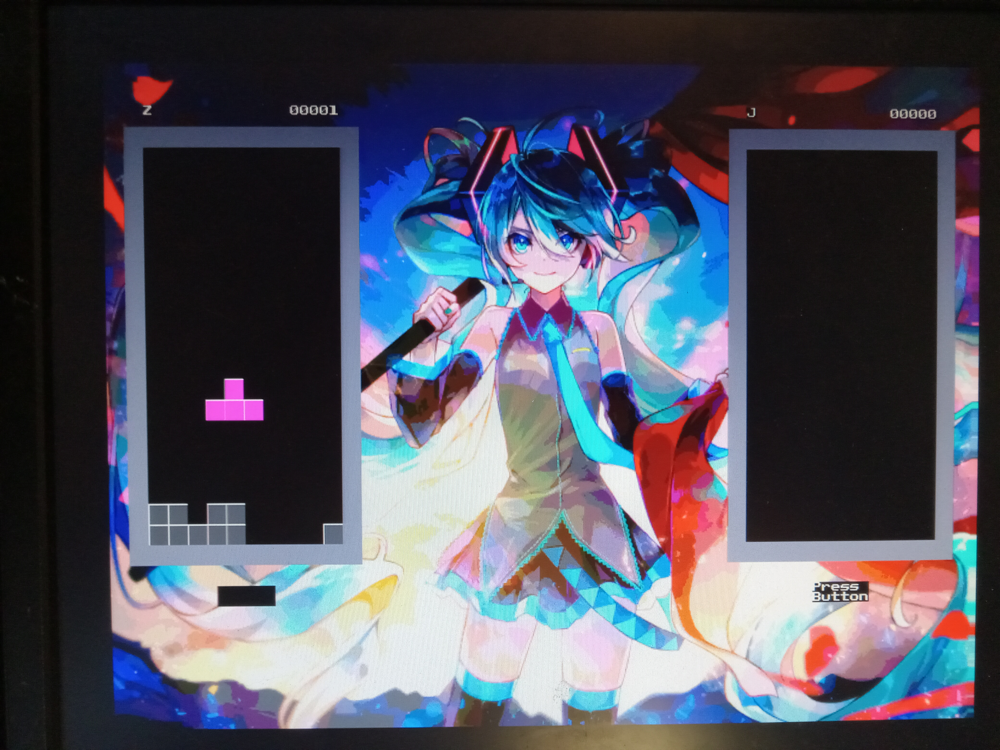

<b><h1>Acolyte Hand PIC'd 32 Retraux Computer</h1></b>

<b>Background</b>

Originally inspired by The 8-Bit Guy's <a href="https://www.youtube.com/watch?v=ayh0qebfD2g">"Dream Computer"</a>, and after some initial attempts (aka failures), I eventually produced the original <a href="https://github.com/stevenchadburrow/AcolyteComputer">Acolyte Computer</a> using a W65C02 processor.  I had great help from <a href="https://wilsonminesco.com/">Garth Wilson</a> and the guys on the <a href="http://6502.org/">6502.org</a> Forum.  

From there, the project grew to the <a href="https://github.com/stevenchadburrow/NewAcolyte">New Acolyte</a> coupled with an XC9572XL CPLD, then the <a href="https://github.com/stevenchadburrow/Acolyte816">Acolyte '816</a> using a W65C816 processor but with a PIC16F886 microcontroller as a bootloader.  Wanting to continue pursuing PIC microcontrollers, I created the original <a href="https://github.com/stevenchadburrow/AcolyteHandPICd">Acolyte Hand PIC'd</a> using the PIC18F47J13 microcontroller, then the <a href="https://github.com/stevenchadburrow/AcolyteHandPICd24">Acolyte Hand PIC'd 24</a> using the PIC24EP512GP204 microcontroller finally without a CPLD.

This project, the Acolyte Hand PIC'd 32, is supposed to show the culmination of my knowledge in PCB design and microcontroller programming.

<b>Microcontroller</b>

PIC32MZ2048EFH144 running at 200 MHz
 
Internal memory of 512KB of RAM and 2MB of Flash ROM

<b>Video</b>

VGA 800x600 max resolution (640x480 typical resolution) at 72 Hz with 256 colors

<b>Audio</b>

Single 4-bit audio channel, adding more bits and channels in the future

<b>HID</b>

2x Sega Genesis controller ports
 
Dual PS/2 port for keyboard and mouse through splitter
 
USB port for keyboard, mouse, or Xbox-360 controller

<b>File System</b>

Elm-Chan's FatFS files using SPI Micro SD Card adapter

<b>UART</b>

FT232RL USB-to-UART adapter (use command 'sudo picocom /dev/ttyUSB0')

<b>Custom Applications</b>

Tetra - Tetris clone recopied from previous PIC-related projects
 
Scratchpad - Proof-of-concept 'text editor' without save/load features
 
AV Demo - Audio/Video playback of modified video files with a resolution 240x192 at 30 Hz with 256 colors and up to 32-bit mono audio

<b>Gameboy Emulator</b>

Mahyar Koshkouei's Peanut-GB (with MiniGB-APU) Gameboy Emulator
 
Added support for GBC default color palettes, game file save/load, and screen size and refresh rate adjustments
 
Tested with many games, including: Tetris, Dr. Mario, Zelda: Link's Awakening, and Pokemon Red

<b>Links</b>

<a href="https://www.aidanmocke.com/">https://www.aidanmocke.com/</a> for a bunch of PIC32MZ projects (without Harmony), including USB. 
<a href="http://elm-chan.org/">http://elm-chan.org/</a> for a bunch of other projects, including MMC (aka SDcard) and FatFs. 
<a href="https://github.com/deltabeard/">https://github.com/deltabeard/</a> for a bunch of projects, including Peanut-GB and MiniGB-APU projects. 

*** Board Edits: Removed the 74HC273 entirely and directly connected latch inputs to outputs.  Also added 4-bit audio DAC to PORTH pins. ***

&nbsp;&nbsp;&nbsp;&nbsp;

